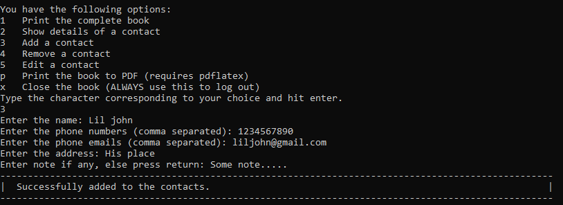

# Phonebook_python
This is a basic phonebook program where you can store your contacts. The numbers and other info are stored locally in a json file.

We are at version 3. Ref `versions.md`.

The program allows you to
- [x] Add a contact with name, multiple phones, multiple emails, address, note,
- [x] Remove a contact,
- [x] Edit details of a contact,
- [x] Search for a contact's details,
- [x] Print the complete book to PDF format (requires `pdflatex`1).

1.  **See [MiKTeX](https://miktex.org/) for a `pdflatex` distribution.**

## How to use
To install the program, navigate to your desired directory and run `git clone https://github.com/zplus11/Phonebook_python.git` in the console. Then run `phonebook.py`. To use this program, you ONLY need that file apart from `pdflatex`.

## Screenshots

*(May not correspond to the latest commit...)*

- Showing the book. Type 1a to list details of each contact.

- Showing detail of a contact.

- Add a contact.

- Remove a contact.

- Edit a contact

- Print the book to PDF

## Versions

#### Version 0 [upto Version 1]
- Launch and minor changes

#### Version 1 [05 Sep, 2023]
- Colour support
- Added `admin` block for saving preferences in `phonebank.json`
- Misc: All numbers are within lists now

#### Version 2 [08 Dec, 2023]
- Added option to export book into pdf
- Fixed some minor bugs

#### Version 3 [13 June, 2024]
- Probably the last version
- Rewrote completely in a far better way

